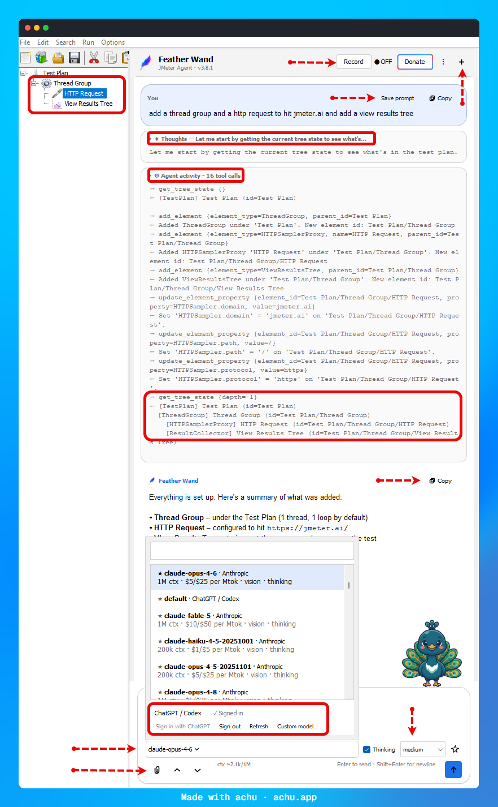
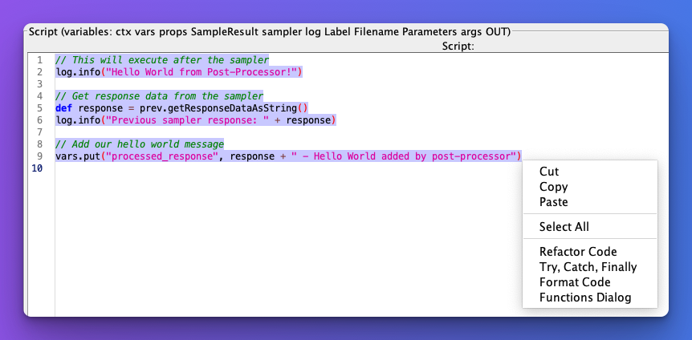
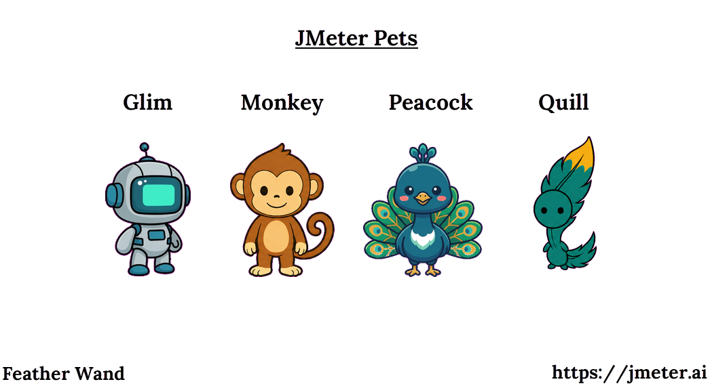

<div align="center">


# 🪶 JmeterAstra

**AI-powered assistant for Apache JMeter**

[](https://github.com/Sunil-Sagar/jmeter-astra/releases)
[](LICENSE)
[](https://github.com/Sunil-Sagar/jmeter-astra)

[Features](#-features) · [Install](#-installation) · [Configure](#-configuration) · [Commands](#-special-commands) · [Changelog](https://github.com/Sunil-Sagar/jmeter-astra/releases)

</div>

> 🪄 **Why "JmeterAstra"?** An *astra* is a focused, high-leverage instrument invoked when you need real force behind a task. JmeterAstra channels that same idea: a sharp, capable AI assistant for your JMeter workflow.

> 🔒 **Anonymous usage telemetry:** starting with v3.8.6, JmeterAstra sends one anonymous ping per day so we can see how many people use it and which features matter. No prompts, keys, or test plan content ever leave your machine. [See what is collected and how to turn it off](#-privacy-and-telemetry).

<div align="center">



</div>

---

## 📑 Contents

- [Features](#-features)
- [Installation](#-installation)
- [Configuration](#-configuration)
- [Corporate LLM gateways](#corporate-llm-gateways)
- [ChatGPT / Codex & Claude Code subscriptions](#-using-jmeterastra-with-chatgpt--codex)
- [Modern Chat UI & Model Picker](#-modern-chat-ui--model-picker)
- [Special Commands](#-special-commands)
- [Agent Mode](#-agent-mode)
- [Streaming](#-streaming-ai-responses)
- [File Attachments](#-file-attachments)
- [Conversation Persistence & Export](#-conversation-persistence--export)
- [Context & Cost Stats](#-context--cost-stats)
- [Response Chime](#-response-chime)
- [Pets](#-pets)
- [AI CLI Terminal](#-multi-ai-cli-terminal)
- [API Setup](#-api-configuration)
- [Privacy and telemetry](#-privacy-and-telemetry)
- [Roadmap & Issues](#-report-issues)
- [Disclaimer](#-disclaimer-and-best-practices)

---

## ✨ Features

| | |
|:---|:---|
| 🤖 **Multi-Model Chat** | Talk to API-backed Claude, OpenAI, Google Gemini, Ollama, Grok (xAI), Meta Muse, or AWS Bedrock models, or use your CLI-managed ChatGPT/Codex or Claude Code account. |
| ⚡ **Real-Time Streaming** | Watch supported API responses appear token-by-token with a **Stop** button to cancel anytime; CLI-backed requests return one completed answer and are cancellable too. |
| 🖥️ **AI CLI Terminal** | Run **Claude Code**, **OpenAI Codex**, **OpenCode**, **Antigravity**, or **Grok CLI** directly in JMeter. This interactive terminal is separate from CLI-backed chat providers. |
| 🧹 **Smart Refactoring** | Right-click in the JSR223 editor to refactor, format, or inject functions with AI. |
| 🔍 **Context-Aware Commands** | `@this`, `@testplan`, `@optimize`, `@lint`, `@wrap`, `@code`, `@usage`, each tailored to your test plan. |
| 🔔 **Audio Chime** | Optional sound notification when AI finishes responding. |
| 🐾 **Companion Pet** | A draggable animated pet that reacts to your test runs: cheers on success, frowns on failures. Pick from quill, glim, peacock, or monkey. |
| 🤖 **Agent Mode** | AI autonomously edits your test plan through 21 tools with API-backed Claude, OpenAI, Gemini, Grok, Meta Muse, or the ChatGPT/Codex and Claude Code CLI providers. |
| **Jev Smart Routing** | Optional TypeSafe Jev intent routing gives Agent Mode a focused tool pack, with a visible route/confidence card and automatic full-tool fallback. |
| 🔧 **Searchable Model Picker** | Search by model or provider, inspect context/cost/capabilities, pin favorites, reuse recent models, and hide non-chat clutter. |
| ⚙️ **Fully Configurable** | Customize prompts, temperature, tokens, history, CLI timeouts/sandboxing, and more via JMeter properties. |
| 🧠 **Thinking & Effort** | Per-model **Thinking** checkbox and effort dropdown in the toolbar; reasoning streams into a collapsible *Thoughts* card in the transcript. |
| 📎 **File Attachments** | Attach `jmeter.log`, results (`.jtl`/`.csv`), or any text file via the paperclip, drag-drop, or paste. Smart digests (percentiles, error breakdowns) instead of raw dumps - on every provider. |
| 💾 **Conversation Persistence** | Chats autosave to `~/.jmeter-ai/sessions/` and can be restored after a JMeter restart. Export any conversation to Markdown or HTML for your test reports. |
| 📊 **Context & Cost Stats** | A live readout shows context-window fill and estimated session cost, using server-reported usage when available and a marked local estimate otherwise. |

---

## 📥 Installation

### Manual Installation

```text
1. Download the latest JAR from Releases
2. Drop it into JMeter's lib/ext directory
3. Copy jmeter-ai-sample.properties into jmeter.properties (or user.properties)
4. Add API keys and/or enable a local subscription CLI provider, then restart JMeter
```

See [Releases](https://github.com/Sunil-Sagar/jmeter-astra/releases) for the latest JAR.

## ⚙️ Configuration

Copy `jmeter-ai-sample.properties` into your `jmeter.properties` or `user.properties` and adjust the values below.

### General Settings

| Property | Description | Default |
|----------|-------------|---------|
| `jmeter.ai.streaming.enabled` | Stream AI responses token-by-token | `true` |
| `jmeter.ai.response.chime` | Play a chime when AI finishes | `false` |
| `jmeter.ai.refactoring.enabled` | Enable JSR223 editor AI refactoring | `true` |
| `jmeter.ai.service.type` | Default AI service for refactoring | `anthropic` |
| `jmeter.ai.cli.max.history.size` | Conversation entries replayed with each one-shot Codex/Claude Code chat request | `10` |

### AI Service Settings

<details>
<summary><b>Anthropic (Claude)</b></summary>

| Property | Description | Default |
|----------|-------------|---------|
| `anthropic.api.key` | Claude API key | **Required** (optional behind a gateway that authenticates via headers) |
| `anthropic.base.url` | Endpoint speaking the Anthropic `/v1/messages` format; point this at a [corporate gateway](#corporate-llm-gateways) | `https://api.anthropic.com` |
| `anthropic.extra.headers` | Extra request headers, `;`-separated `name=value` pairs | *(empty)* |
| `anthropic.max.retries` | Automatic SDK retries on 429/5xx; set `0` behind a [quota-limited gateway](#token-quotas-and-429-errors) | `2` |
| `anthropic.models` | Explicit model list (comma-separated) for gateways that don't expose model listing | *(empty)* |
| `claude.default.model` | Default model | `claude-sonnet-4-6` |
| `claude.temperature` | Temperature (0.0-1.0) | `0.5` |
| `claude.max.tokens` | Max response tokens | `1024` |
| `claude.max.history.size` | Conversation history size | `10` |
| `claude.system.prompt` | System prompt | See sample file |
| `anthropic.log.level` | Logging (`info`/`debug`) | *(empty)* |

</details>

<details>
<summary><b>OpenAI</b></summary>

| Property | Description | Default |
|----------|-------------|---------|
| `openai.api.key` | OpenAI API key | **Required** (optional behind a gateway that authenticates via headers) |
| `openai.base.url` | Endpoint speaking the OpenAI `/v1/chat/completions` format; point this at a [corporate gateway](#corporate-llm-gateways) | `https://api.openai.com/v1` |
| `openai.extra.headers` | Extra request headers, `;`-separated `name=value` pairs | *(empty)* |
| `openai.models` | Explicit model list (comma-separated) for gateways that don't expose `GET /v1/models` | *(empty)* |
| `openai.max.retries` | Automatic SDK retries on 429/5xx; set `0` behind a [quota-limited gateway](#token-quotas-and-429-errors) | `2` |
| `openai.default.model` | Default model | `gpt-4o` |
| `openai.temperature` | Temperature (0.0-1.0) | `0.5` |
| `openai.max.tokens` | Max response tokens | `1024` |
| `openai.max.history.size` | Conversation history size | `10` |
| `openai.system.prompt` | System prompt | See sample file |
| `openai.log.level` | Logging (`INFO`/`DEBUG`) | *(empty)* |

</details>

<details>
<summary><b>ChatGPT / Codex (CLI-managed account; no plugin API key)</b></summary>

Uses the authentication managed by your local [Codex CLI](https://github.com/openai/codex). It normally uses ChatGPT, but an API key configured inside Codex is also recognized. JmeterAstra does not require or inspect `openai.api.key` for this provider. See [Using JmeterAstra with ChatGPT / Codex](#-using-jmeterastra-with-chatgpt--codex).

| Property | Description | Default |
|----------|-------------|---------|
| `jmeter.ai.codex.enabled` | Show the ChatGPT/Codex status and models in the picker after restart | `false` |
| `jmeter.ai.codex.executable` | Full path to the `codex` binary | *(PATH auto-detect)* |
| `jmeter.ai.codex.timeout.seconds` | Hard timeout for one `codex exec` request | `120` |
| `jmeter.ai.codex.login.timeout.seconds` | Timeout for the CLI-owned browser login flow | `300` |
| `jmeter.ai.codex.models` | Comma-separated raw model ids added beside `codex:default` | *(empty = CLI default only)* |
| `jmeter.ai.codex.sandbox` | Sandbox passed to `codex exec` (`read-only`, `workspace-write`, or `danger-full-access`) | `read-only` |

</details>

<details>
<summary><b>Claude Code (CLI-managed account; no plugin API key)</b></summary>

Uses the authentication managed by your local [Claude Code CLI](https://docs.anthropic.com/en/docs/claude-code), including a Claude subscription, Anthropic Console key, or supported cloud credentials. JmeterAstra does not require or inspect `anthropic.api.key` for this provider. See [Using JmeterAstra with Claude Code](#-using-jmeterastra-with-claude-code).

| Property | Description | Default |
|----------|-------------|---------|
| `jmeter.ai.claudecode.provider.enabled` | Show the Claude Code status and models in the picker after restart | `false` |
| `jmeter.ai.claudecode.executable` | Full path to the `claude` binary | *(PATH auto-detect)* |
| `jmeter.ai.claudecode.timeout.seconds` | Hard timeout for one `claude -p` request | `120` |
| `jmeter.ai.claudecode.login.timeout.seconds` | Timeout for the CLI-owned browser login flow | `300` |
| `jmeter.ai.claudecode.models` | Comma-separated raw model ids added beside `claude-code:default` | *(empty = CLI default only)* |

> These chat/Agent Mode providers are **not** the `jmeter.ai.terminal.*` integration, which controls the separate interactive terminal tab.

</details>

<details>
<summary><b>Google Gemini</b></summary>

| Property | Description | Default |
|----------|-------------|---------|
| `google.api.key` | Google AI API key | **Required** |
| `google.default.model` | Default model | `gemini-3.5-flash` |
| `google.temperature` | Temperature (0.0-1.0) | `0.7` |
| `google.max.tokens` | Max response tokens | `4096` |
| `google.max.history.size` | Conversation history size | `10` |
| `google.system.prompt` | System prompt | See sample file |

</details>

<details>
<summary><b>Ollama (Local)</b></summary>

| Property | Description | Default |
|----------|-------------|---------|
| `ollama.host` | Server host | `http://localhost` |
| `ollama.port` | Server port | `11434` |
| `ollama.default.model` | Default model | `llama3.1` |
| `ollama.temperature` | Temperature (0.0-1.0) | `0.5` |
| `ollama.max.history.size` | Conversation history size | `10` |
| `ollama.thinking.mode` | Extended thinking (`ENABLED`/`DISABLED`) | `DISABLED` |
| `ollama.thinking.level` | Thinking depth (`LOW`/`MEDIUM`/`HIGH`) | `MEDIUM` |
| `ollama.request.timeout.seconds` | Request timeout | `120` |
| `ollama.system.prompt` | System prompt | See sample file |

> ⚠️ If `ollama.thinking.mode=ENABLED`, raise `ollama.request.timeout.seconds` to at least `300`.

</details>

<details>
<summary><b>Grok (xAI)</b></summary>

| Property | Description | Default |
|----------|-------------|---------|
| `grok.api.key` | xAI API key | **Required** |
| `grok.default.model` | Default model | `grok-4.5` |
| `grok.temperature` | Temperature (0.0-1.0) | `0.7` |
| `grok.max.tokens` | Max response tokens | `4096` |
| `grok.max.history.size` | Conversation history size | `10` |
| `grok.system.prompt` | System prompt | See sample file |

</details>

<details>
<summary><b>Meta Muse</b></summary>

| Property | Description | Default |
|----------|-------------|---------|
| `meta.api.key` | Meta AI API key | **Required** |
| `meta.base.url` | Base URL endpoint | `https://api.meta.ai/v1` |
| `meta.default.model` | Default model | `muse-spark-1.1` |
| `meta.temperature` | Temperature (0.0-1.0) | `0.7` |
| `meta.max.tokens` | Max response tokens | `4096` |
| `meta.max.history.size` | Conversation history size | `10` |
| `meta.system.prompt` | System prompt | See sample file |

</details>

<details>
<summary><b>AWS Bedrock</b></summary>

JmeterAstra uses Bedrock's standardized **Converse** and **ConverseStream** APIs for chat requests. This provides one request and streaming format across compatible Anthropic, Meta, Mistral, MiniMax, Amazon, and other Bedrock text-generation models instead of requiring a provider-specific payload formatter.

| Property | Description | Default |
|----------|-------------|---------|
| `bedrock.api.key` | Bedrock API key (bearer token) | *(empty)* |
| `bedrock.aws.access.key` | IAM access key; used when no Bedrock API key is set | *(empty)* |
| `bedrock.aws.secret.key` | IAM secret key | *(empty)* |
| `bedrock.aws.region` | AWS Region used for discovery and inference | `us-east-1` |
| `bedrock.default.model` | Default Bedrock model ID | `anthropic.claude-3-5-sonnet-20241022-v2:0` |
| `bedrock.model.providers` | Comma-separated provider filter | `Anthropic` |
| `bedrock.temperature` | Temperature | `0.5` |
| `bedrock.max.tokens` | Maximum response tokens | `4096` |
| `bedrock.max.history.size` | Conversation history size | `10` |
| `bedrock.system.prompt` | System prompt | See sample file |

**Authentication priority:** Bedrock API key, IAM access key and secret key, then the AWS default credential chain. Do not commit credentials to a properties file or source repository.

**Model discovery:** The selector includes active, text-capable foundation models and active system-defined inference profiles matching `bedrock.model.providers`. Inference profiles are checked for agreement, authorization, entitlement, and regional availability before they are shown. Models such as image, embedding, reranking, and speech models are excluded from the chat selector.

**Anthropic access:** Anthropic models may require the Bedrock First-Time Use form, AWS Marketplace permissions, a valid payment method, and an active model agreement. If `get-foundation-model-availability` reports `agreementAvailability=NOT_AVAILABLE`, the model can be visible in AWS discovery but cannot be invoked by the account yet.

**Compatibility:** Chat models must support Bedrock Converse/ConverseStream. Models that only provide embeddings, image generation, audio, video, or other non-chat capabilities require a separate feature flow and cannot be used in this chat panel.

Restart JMeter after changing Bedrock properties or installing a new plugin JAR.

See the [Bedrock Converse API documentation](https://docs.aws.amazon.com/bedrock/latest/userguide/conversation-inference.html) and [model access documentation](https://docs.aws.amazon.com/bedrock/latest/userguide/model-access.html) for account setup and model availability details.

</details>

### Corporate LLM Gateways

If your organization fronts OpenAI or Anthropic with an internal gateway (LiteLLM, Azure API Management, Apigee, Kong, Portkey, Bedrock Access Gateway, ...), point JmeterAstra at it instead of the vendor host. Any gateway that speaks the OpenAI `/v1/chat/completions` or Anthropic `/v1/messages` wire format works, with no gateway-specific setup:

```properties
# OpenAI-compatible gateway
openai.base.url=https://llm-gateway.corp.example.com/v1
openai.extra.headers=X-Gateway-Key=<your-gateway-key>;X-Team=perf
openai.models=corp-gpt-4o,corp-gpt-4o-mini

# Anthropic-compatible gateway
anthropic.base.url=https://llm-gateway.corp.example.com
anthropic.extra.headers=X-Gateway-Key=<your-gateway-key>;X-Team=perf
anthropic.models=corp-claude-sonnet,corp-claude-haiku
```

- **Authentication.** Use `*.api.key` when the gateway expects the usual vendor auth header (many issue a "virtual key"). When it authenticates purely through its own header, set `*.extra.headers` and leave `*.api.key` unset: the gateway configuration alone is enough for the chat panel and the JSR223 refactoring menu. Values may contain `=` (only the first `=` separates name from value). Header names are gateway-specific, so take them from your gateway's own documentation.
- **Model list.** Gateways often don't expose model listing, or return names the vendor filter would drop. Set `*.models` to list them explicitly and JmeterAstra skips the discovery call entirely. With a custom base URL the `gpt` prefix requirement is also lifted, so ids like `azure/gpt-4o` survive.
- **Transport.** Use `https://`. A plaintext `http://` base URL still works (useful for a loopback or in-cluster endpoint) but logs a warning, since keys and prompts would travel unencrypted.
- **TLS interception.** If your gateway presents a certificate from an internal CA, add it to the truststore JMeter runs with (for example `-Djavax.net.ssl.trustStore=...`).

#### Gateway troubleshooting

First confirm the gateway works outside JMeter, using the same URL, header and model id you put in the properties:

```bash
curl -sS https://llm-gateway.corp.example.com/v1/chat/completions \
  -H "Content-Type: application/json" \
  -H "X-Gateway-Key: $GATEWAY_KEY" \
  -d '{"model":"corp-gpt-4o","messages":[{"role":"user","content":"ping"}]}'
```

| Symptom | Likely cause |
|---------|--------------|
| Requests still reach `api.openai.com` / `api.anthropic.com` | Properties aren't loaded. They must be in `jmeter.properties` or `user.properties`, and JMeter must be restarted. `jmeter.log` logs the effective endpoint: `Initialized OpenAI service with baseUrl: ...` |
| No gateway models in the picker | The gateway doesn't serve a model-listing endpoint, or returns ids the filter drops. Set `openai.models` / `anthropic.models` explicitly |
| `Error adding OpenAI models` / `Error loading Anthropic models` in `jmeter.log` | The discovery call failed: wrong base URL path, untrusted certificate, or missing auth header |
| 401 / 403 on chat | The gateway wants its own header (`*.extra.headers`), or expects a virtual key in `*.api.key` rather than your vendor key |
| 404 on chat | Base URL path is off. OpenAI-compatible URLs normally end in `/v1`, Anthropic-compatible ones do not |
| `PKIX path building failed` | The gateway's certificate chains to an internal CA; start JMeter with `-Djavax.net.ssl.trustStore=/path/to/corp-truststore.jks` |
| `uses plaintext HTTP` warning | The base URL is `http://`; switch to `https://` unless it's a loopback endpoint |
| `429` / `RateLimitException` / "token quota exceeded" | Usually the gateway's token budget is smaller than one Agent Mode request (a 429 can also be a request-rate or concurrency throttle; the panel shows the gateway's own message); see [Token quotas and 429 errors](#token-quotas-and-429-errors) |

#### Token quotas and 429 errors

Agent Mode is token-hungry by design: every reason/act turn re-sends the system prompt (including the JMeter element hierarchy), all 21 tool definitions and the full conversation so far, and even a trivial request takes 2-4 turns (the agent reads the tree first). That fixed overhead is several thousand tokens per turn, so a gateway tier with a small budget (for example 10K tokens per 5 minutes) is exhausted on the first or second turn, whatever the prompt says. Some gateways also count `max_tokens` against the quota before the request runs.

What helps, roughly in order of impact:

- **Turn off automatic retries**: `openai.max.retries=0` (or `anthropic.max.retries=0`). The SDK otherwise retries a 429 twice with backoff, tripling the tokens charged for one click. The chat panel now shows the gateway's own 429 message instead of retrying as plain chat.
- **Lower `jmeter.ai.agent.max.tokens`** (e.g. `1024`) if your gateway reserves `max_tokens` up front.
- **Start a new chat** per task: up to 10 prior turn pairs are re-sent with each agent request.
- **Use plain chat** (deselect Agent Mode) for questions and snippets; it sends no tool schemas or hierarchy and costs a fraction per request.
- **Measure**: each agent turn logs `Agent token usage [...] prompt=... completion=... | run total: ...` in `jmeter.log`, so you can compare a run against your quota before asking for a larger tier.

If the quota is fixed at a few thousand tokens per window, Agent Mode will not fit; ask the gateway team for a larger allocation for the JmeterAstra client.

If that doesn't settle it, paste the following into your own LLM (redact secrets first):

```text
I'm using the JmeterAstra plugin for Apache JMeter and routing it through my
company's LLM gateway instead of the vendor endpoint. It isn't working.

My JmeterAstra properties (secrets redacted, header NAMES kept):
  openai.base.url=...
  openai.extra.headers=...
  openai.models=...
  openai.default.model=...
  openai.api.key=<set | not set>
  (or the anthropic.* equivalents)

What JMeter shows me: <error text from the JmeterAstra chat panel>

Relevant jmeter.log lines: <lines mentioning baseUrl, models, or an exception>

How my gateway works: it speaks the <OpenAI /v1/chat/completions | Anthropic
/v1/messages> wire format, authenticates via <bearer API key | custom header
named X-...>, and <does | does not> expose a model-listing endpoint. Its
documentation says: <paste the relevant part>

Tell me which of these is wrong and give me the corrected property lines:
the base URL (including whether a /v1 suffix belongs there), the auth header
name and whether the key should go in openai.api.key instead, the model ids,
or the TLS trust configuration.
```

Restart JMeter after changing gateway properties.

### AI CLI Terminal

| Property | Description | Default |
|----------|-------------|---------|
| `jmeter.ai.terminal.claudecode.enabled` | Enable the embedded terminal | `true` |
| `jmeter.ai.terminal.claudecode.path` | Full path to `claude` binary | *(auto-detect)* |
| `jmeter.ai.terminal.copilot.enabled` | Enable GitHub Copilot CLI | `false` |
| `jmeter.ai.terminal.copilot.path` | Full path to `copilot` binary | *(auto-detect)* |
| `jmeter.ai.terminal.antigravity.enabled` | Enable Antigravity CLI | `false` |
| `jmeter.ai.terminal.grok.enabled` | Enable Grok CLI | `false` |
| `jmeter.ai.terminal.font.family` | Terminal font family (e.g. `Consolas`, `Noto Sans Mono CJK SC`) | *(auto-detect)* |
| `jmeter.ai.terminal.font.size` | Terminal font size | `16.0` |
| `jmeter.ai.terminal.font.cjk.fallback` | Fall back to a CJK-capable font when the selected font cannot display CJK | `true` |

#### Terminal font & CJK support

The terminal uses the font family you configure. If `jmeter.ai.terminal.font.cjk.fallback=true` and the selected font cannot display CJK characters, the plugin automatically picks the best CJK-capable font installed on your system (`NSimSun`, `SimSun`, `MS Gothic`, `Microsoft YaHei`, `Malgun Gothic`, etc.).

| Use case | Recommended configuration |
|----------|---------------------------|
| English / Latin only; keep your Western monospaced font | `jmeter.ai.terminal.font.family=Consolas`<br>`jmeter.ai.terminal.font.size=16.0`<br>`jmeter.ai.terminal.font.cjk.fallback=false` |
| CJK support; let the plugin pick the best available font | `jmeter.ai.terminal.font.size=16.0`<br>`jmeter.ai.terminal.font.cjk.fallback=true` |
| CJK support with a specific installed font | `jmeter.ai.terminal.font.family=Noto Sans Mono CJK SC`<br>`jmeter.ai.terminal.font.size=16.0`<br>`jmeter.ai.terminal.font.cjk.fallback=false` |

> ⚠️ When `cjk.fallback=true` with a non-CJK font like `Consolas`, the configured family is overridden because `Consolas` has no CJK glyphs. If you want to force `Consolas`, set `cjk.fallback=false`; CJK will then render as boxes.

**Prerequisite CLIs**

| CLI | Binary | Install Guide |
|-----|--------|---------------|
| Claude Code | `claude` | [Docs](https://docs.anthropic.com/en/docs/claude-code) |
| OpenAI Codex | `codex` | [Repo](https://github.com/openai/codex) |
| GitHub Copilot | `copilot` | [Docs](https://docs.github.com/en/copilot/how-tos/copilot-cli/cli-getting-started) |
| OpenCode | `opencode` | [Repo](https://github.com/sst/opencode) |
| Antigravity | `agy` | [Site](https://www.antigravity.google/product/antigravity-cli) |
| Grok CLI | `grok` | [Console](https://console.x.ai/) |

### Custom System Prompts

Each service supports its own `*.system.prompt` property; tweak them in your properties file to focus the AI on specific JMeter topics or team conventions.

## 🔐 Using JmeterAstra with ChatGPT / Codex

JmeterAstra can use the account already managed by your local Codex CLI. It normally uses a **ChatGPT subscription**, but a Codex CLI API-key session is recognized too. This is a separate provider from the OpenAI API integration and does not require `openai.api.key` in JmeterAstra.

> **IMPORTANT: Check your provider's current terms before using a subscription.**
>
> OpenAI, Anthropic, and other LLM or CLI providers may change their terms of service, acceptable-use policies, subscription eligibility, rate limits, features, or billing at any time. Before enabling a subscription-backed provider in JmeterAstra, review the current terms for your account and confirm that your plan permits this type of use.
>
> You are responsible for complying with the provider's terms and for monitoring usage, limits, and charges. JmeterAstra is an independent integration and is not affiliated with or endorsed by these providers. It does not guarantee continued access or compatibility. To the extent permitted by law, the project and its maintainers are not responsible for provider-side changes, account restrictions or suspension, unexpected charges, or other consequences resulting from your use. Double-check the current terms before proceeding.

1. Install the CLI: `npm install -g @openai/codex` (see the [Codex repo](https://github.com/openai/codex)).
2. Add `jmeter.ai.codex.enabled=true` to `user.properties` and restart JMeter.
3. Open the model picker. Its footer shows a **ChatGPT / Codex** row even when the CLI still needs to be installed or signed in.
4. Click **Sign in with ChatGPT** (or run `codex login`) and complete the browser flow owned by Codex.
5. Select `default` to let Codex choose its configured model, select a model from `jmeter.ai.codex.models`, or use **Custom model…**.

Statuses include `✓ Signed in`, `Signed in using API key`, `Not signed in`, `Codex CLI not installed`, and `Unable to determine status`. **Refresh** clears cached executable discovery, re-runs `codex login status`, and adds configured models after a CLI is installed without reopening JMeter.

## 🔐 Using JmeterAstra with Claude Code

The same flow works with the authentication managed by Claude Code: a **Claude Pro/Max subscription**, an Anthropic Console key, or supported cloud credentials. This provider is separate from the Anthropic API integration and does not require `anthropic.api.key` in JmeterAstra.

1. Install the CLI: `npm install -g @anthropic-ai/claude-code` (see the [Claude Code docs](https://docs.anthropic.com/en/docs/claude-code)).
2. Add `jmeter.ai.claudecode.provider.enabled=true` to `user.properties` and restart JMeter.
3. In the model-picker footer, click **Sign in with Claude** (or run `claude auth login --claudeai`) and complete the CLI-owned browser flow.
4. Select `default`, a model from `jmeter.ai.claudecode.models`, or a model entered through **Custom model…**.

The footer offers the same **Sign in**, **Sign out**, **Refresh**, and **Custom model…** actions and reports signed-in, API-key, signed-out, missing-CLI, or unknown states.

### What JmeterAstra runs

| Provider | Authentication commands | Prompt command |
|----------|-------------------------|----------------|
| **ChatGPT / Codex** | `codex login status`, `codex login`, `codex logout` | `codex exec` with the prompt on UTF-8 stdin, the configured sandbox, optional `--model`, and a clean last-message output file |
| **Claude Code** | `claude auth status --json`, `claude auth login --claudeai`, `claude auth logout` | `claude -p --output-format text` with the prompt on UTF-8 stdin and optional `--model` |

Commands are launched directly with `ProcessBuilder`, never through a shell, and prompt text is never interpolated into the command line. Standard output and error are drained concurrently off the Swing event thread. Each request has a hard timeout; timeout or **Stop** terminates the CLI process and its descendants.

CLI-backed chat is one-shot: the most recent `jmeter.ai.cli.max.history.size` conversation entries are flattened with the JMeter system prompt and replayed on every request. The completed answer arrives as one chunk rather than token-by-token, even when `jmeter.ai.streaming.enabled=true`.

JmeterAstra asks each CLI for auth status and invokes its login/logout commands, but never reads, copies, logs, or deletes CLI credential files or tokens.

### Provider modes are separate

| Mode | Credential source | Billing/account |
|------|-------------------|-----------------|
| **OpenAI API** (`openai:*`) | `openai.api.key` read by JmeterAstra | OpenAI API usage |
| **ChatGPT / Codex** (`codex:*`) | Session managed entirely by the Codex CLI | Whatever account Codex reports (ChatGPT or API key) |
| **Anthropic API** (unprefixed Claude models) | `anthropic.api.key` read by JmeterAstra | Anthropic API usage |
| **Claude Code** (`claude-code:*`) | Session managed entirely by the Claude Code CLI | Whatever account Claude Code reports (subscription, API key, or cloud) |

Switching providers never rewrites or removes the other providers' settings.

### Picking a subscription model

The CLIs publish no model list, so the picker offers `codex:default` / `claude-code:default` (let the CLI decide) plus raw ids from `jmeter.ai.codex.models` / `jmeter.ai.claudecode.models`. For an id that is not listed, click **Custom model…**, type the raw id (for example, `gpt-5.6-sol`), and it is selected immediately, with no properties edit or restart. Custom ids are remembered in `~/.jmeter-ai/model-selector.json` and passed as `--model`; an unsupported id therefore returns a CLI error instead of silently falling back. API-backed providers continue to list models from their provider APIs.

### Agent Mode with CLI providers

Both CLI providers participate in the same 18-tool Agent Mode loop. Because the CLIs expose no native tool-calling API to JmeterAstra, each prompt contains the available tool schemas and requests one JSON object with either `tool_calls` or a `final` answer. Tool results are replayed into the next one-shot CLI request; non-JSON output safely becomes the final plain-text answer. Existing iteration limits and destructive-tool confirmations still apply.

The Codex child process uses `jmeter.ai.codex.sandbox` (`read-only` by default); Claude Code follows its own CLI permissions and configuration. JmeterAstra's **Thinking** and effort controls do not override either CLI's reasoning budget; the CLI owns that behavior.

## 🎨 Modern Chat UI & Model Picker

The redesigned chat panel uses shared spacing, typography, button, and theme tokens so it follows JMeter's active light/dark look-and-feel, live theme changes, and UI scaling. No additional property is required.

### Composer

- The model selector, per-model **Thinking/effort** controls, and favorite star live inside the rounded composer instead of a separate navigation block. The selected model uses normal body-sized text for readability.
- The lower row keeps attachments, prompt-history navigation, context/cost status, a responsive keyboard hint, and the primary send action together. **Send** swaps to **Stop** while a request is running.
- `Enter` sends and `Shift+Enter` inserts a newline. IME composition is tracked so Enter can confirm Chinese, Japanese, or Korean input before sending.
- The composer shows a theme-aware focus ring when active and a restrained animated gradient while the AI is processing.

### Searchable model picker

- Search matches the friendly model name, provider name, or raw prefixed id, case-insensitively.
- Two-line rows show provider plus available models.dev metadata: context window, input/output price per million tokens, vision, and thinking support. Unknown and local models remain usable without metadata.
- Models are ordered **pinned → recently used → all others**. Pinned order is preserved, recents are most-recent-first and capped at eight, and the remainder is alphabetical by display name.
- Use the toolbar star or the star zone on any picker row to pin/unpin. Pins, recents, and custom subscription models persist in `~/.jmeter-ai/model-selector.json` and stay synchronized across both star controls.
- The popup opens above or below the selector according to available screen space. Type to filter, use Down/Enter to select, Esc or an outside click to cancel, or double-click a row.
- Enabled Codex and Claude Code providers add their asynchronous auth/status actions to the footer without blocking the UI.

### Header and transcript

- The responsive header keeps the new-conversation and overflow/export actions available on narrow panels while de-emphasizing optional identity or recording controls.
- A dedicated welcome state, tinted user bubbles, flat assistant responses, Markdown/code/table rendering, attachment chips, and consistent light/dark colors improve scanning.
- Every message has **Copy**; user messages also expose **Save prompt** for the reusable prompt library.

## 🔍 Special Commands

Type any of these directly in the chat box. All commands are context-aware and work with the currently selected test-plan element.

| Command | What it does | Example |
|---------|--------------|---------|
| `@this` | Describe the selected element and suggest best practices. | `How do I configure @this?` |
| `@testplan` | Send the entire test plan tree context to the AI (e.g. to find all target URLs). | `@testplan which URL is under test?` |
| `@optimize` | Analyze the selected element and suggest performance tweaks. | `@optimize` or `optimize this sampler` |
| `@lint` | Auto-rename elements for consistency. Undo/redo supported. | `@lint rename elements in PascalCase` |
| `@wrap` | Group HTTP samplers under Transaction Controllers. | `@wrap` *(select a Thread Group first)* |
| `@code` | Extract the last AI code block into the JSR223 editor. | `@code` |
| `@usage` | Show token-usage stats and recent conversation history. | `@usage` |
| `@prompts` | Browse and insert prompts from the prompt library. | `@prompts analyze` |

### 📚 Prompt Library

Type `@prompts` in the chat input to open the prompt picker. It ships with six built-in starters (*Analyze results*, *Review plan vs best practices*, *Explain errors in jmeter.log*, *Suggest assertions & timers*, *Find correlation candidates*, *Recording brief*) and grows with your own prompts.

- **Insert**: `Enter` puts the prompt text into the input box so you can edit it (fill in the `[bracketed]` placeholders, attach files) before sending.
- **Save**: click **Save prompt** on any of your own messages to add it to the library (attachment markers become `[file name]` references).
- **Manage**: in the picker, `Del` deletes one of your prompts (confirmed), `F2` edits/renames it. Built-ins are read-only. Pressing `F2` on one offers **Save as copy** so you can adapt it.

User prompts live in `~/.jmeter-ai/prompts.json` (unencrypted, so do not save credentials; override the path with `jmeter.ai.prompts.file`).

### `@lint` Tips
- Run it after importing a recorded test plan to clean up generic names.
- Use it before sharing plans with your team.
- Apply custom rules: `@lint rename based on the URL`.

### `@wrap` Details
`@wrap` uses pattern matching (not AI) to group related HTTP samplers under Transaction Controllers, preserving child elements and hierarchy. Great for imported or recorded plans.

## 🤖 Agent Mode

Agent Mode lets the AI **autonomously edit your live JMeter test plan** through a tool-calling loop. Instead of just chatting about what you should do, the agent reads the tree, reasons about needed changes, calls tools to mutate elements, verifies the results, and iterates until the task is done, all inside the existing chat panel.

> ⚠️ **Supported Agent Mode backends:** API-backed **Anthropic Claude**, **OpenAI**, **Google Gemini**, **Grok**, and **Meta Muse**, plus the **ChatGPT / Codex CLI** and **Claude Code CLI** providers. Ollama and Bedrock currently fall back to plain chat.

<div align="center">



</div>

### Enabling Agent Mode

Agent Mode is **off by default**. To turn it on:

```properties
# In user.properties or jmeter.properties
jmeter.ai.agent.enabled=true
```

Select a **Claude**, **OpenAI**, **Google Gemini**, **Grok**, or **Meta Muse** model from the dropdown. Then just type your request naturally in the chat box; if Agent Mode is enabled and a supported model is selected, the agent loop activates automatically.

> If a model from any other provider is selected, the request is handled by the regular (non-agentic) chat path.

All supported providers share the same tool registry, system prompt, safety gates and iteration limits; only the wire format differs (Anthropic `tool_use` blocks, OpenAI-compatible function `tool_calls`, or Gemini `functionCall`/`functionResponse` parts). When optional Jev Smart Routing is enabled, the provider receives a focused subset for confident single-purpose requests and the complete registry for complex, uncertain, or failed routing.

> 💡 **OpenAI note**: temperature is left at the model default for agent runs, so reasoning models (`o1`, `o3`, `o4`, `gpt-5`) work without extra configuration. `jmeter.ai.agent.max.tokens` maps to `max_completion_tokens`. For **gpt-5.1 and later** (`gpt-5.6-terra`, `gpt-5.6-sol`, ...) the agent automatically sends `reasoning_effort=none`, because those models reject function tools on `/v1/chat/completions` while reasoning is on, so tool calling works out of the box.

> 💡 **OpenAI-compatible provider note**: for Grok and Meta Muse agent runs, `reasoning_effort` is not sent; the vendor default applies. For Meta Muse, agent runs go through Chat Completions rather than the Responses API used for plain chat, so the Thoughts card is not populated during agent runs.

> 💡 **Thinking in Agent Mode (Claude & Gemini)**: when the Thinking checkbox is on, each agent turn's reasoning accumulates in a collapsed **Thoughts** card next to the tool-activity group. Agent loops pay the thinking budget on *every* iteration; keep the effort at `medium`, or pin an agent-only level with `jmeter.ai.agent.thinking.effort` (empty = follows the toolbar).

### Optional Jev Smart Routing

[Jev](https://docs.typesafe.ai/concepts/system-one) is an optional TypeSafe judgment model used only to classify an Agent Mode request before the selected chat model starts. A confident single-purpose classification advertises a focused tool pack; complex requests, low confidence, missing configuration, or service failures receive the complete standard registry.

```properties
jmeter.ai.typesafe.enabled=true
jmeter.ai.typesafe.agent.routing.enabled=true
jmeter.ai.typesafe.agent.routing.min.confidence=0.75
jmeter.ai.typesafe.agent.routing.expansion.enabled=false
jmeter.ai.typesafe.agent.routing.expansion.max=1
jmeter.ai.typesafe.agent.triage.enabled=false
jmeter.ai.typesafe.agent.triage.max.failures=5
typesafe.api.key=YOUR_TYPESAFE_API_KEY
typesafe.base.url=https://api.typesafe.ai
typesafe.model=jev-latest
typesafe.timeout.seconds=15
```

When enabled, every request shows a dedicated **Jev Smart Route** card before agent activity. It identifies the selected route, confidence, focused/total tool counts, and the chat model that still performs the work. Uncertain routing shows that all tools are being used; a TypeSafe failure shows that standard Agent Mode is being used.

With `jmeter.ai.typesafe.agent.routing.expansion.enabled=true`, a focused pack also advertises an `expand_tools` escape hatch: if the model realises it needs a capability outside its pack, it can ask for more tools instead of giving up. Jev re-classifies the request with the model's stated need, the live tool set grows (never shrinks, capped by `expansion.max`, never beyond the full registry), and a second **Jev Expanded Tools** card lists what was added. The grown tool set is re-advertised to the provider on the model's next request, so newly added tools are actually callable — for the API-backed models (Claude, OpenAI, Gemini, Grok, Meta Muse) and for the subscription CLIs, whose tool protocol is re-issued in the next prompt. Newly exposed destructive tools still require the usual confirmation.

With `jmeter.ai.typesafe.agent.triage.enabled=true` (independent of routing), Jev also classifies failures reported by `get_test_results`. Each unique failure signature — sampler label, response code, and a bounded message — gets one Choice judgment into a root-cause bucket (connection, timeout, 4xx/5xx, auth/session, assertion, script, config), capped at `triage.max.failures` signatures per run. The verdicts surface in a **Jev Failure Triage** card grouped by category with a dominant-cause callout, and an advisory summary is appended to the tool result so the chat model diagnoses from a categorized picture. Triage is advisory only: unavailable Jev, a missing key, or a clean run leaves the result untouched.

Jev never appears in the model picker, generates the answer, selects tool arguments, executes a tool, or bypasses destructive-operation confirmation. JmeterAstra sends TypeSafe only the current request with attachment bodies removed plus, for triage, failure labels/codes/truncated messages; it does not send conversation history, the serialized test plan, element properties, result bodies, headers, cookies, or provider credentials. Leave either feature flag false to make zero TypeSafe requests and preserve the original Agent Mode path.

TypeSafe currently publishes Python and JavaScript/TypeScript SDKs; JmeterAstra's Java 17 integration uses the documented [`POST /v1/systemone` HTTP API](https://docs.typesafe.ai/api) directly.

### Claude vs. OpenAI vs. Gemini: How the Adapters Differ

The API-backed Agent Mode providers are driven through the exact same provider-neutral `ChatModel` seam (`start`/`next`) and share one `JsonSchemaMapper`, so every tool looks byte-identical across them; only the wire format differs:

| Aspect | Anthropic Claude (`anthropic-java`) | OpenAI (`openai-java`) | Google Gemini (`google-genai`) |
|--------|--------------------------------------|--------------------------|----------------------------------|
| Tool definition | `Tool` (native tool schema) | `ChatCompletionFunctionTool` (function-type only; non-function "custom" tool calls are ignored) | `FunctionDeclaration` inside a `Tool` |
| System prompt | Top-level `system` string, separate from `messages` | A message inside the rolling `messages` list | `systemInstruction` on the request config, separate from `contents` |
| Message roles | `user` / `assistant` only (tool outcomes ride back as a `user` turn of `tool_result` content blocks) | `system` / `user` / `assistant` / **`tool`** | `user` / `model` only (tool outcomes ride back as a `user` turn of `functionResponse` parts) |
| Tool-call arguments | Already a `JsonValue` → converted to a `Map` directly | A JSON **string** → parsed with Jackson (tolerates malformed JSON) | Already a `Map<String, Object>` - no parsing needed |
| Tool-result error signaling | Native `is_error` boolean | No native error flag; errors are conveyed via an `ERROR [...]` prefix in the content | No native error flag either; the same `ERROR [...]` prefix is also placed under an `error` response key |
| Model-specific quirks | None needed | `reasoning_effort=none` forced for gpt-5.1+ (else tool calls 400); temperature never sent (o1/o3/o4/gpt-5 reject non-default values) | JSON-Schema `type` keywords are upper-cased (`string` → `STRING`) to match Gemini's `Type` enum; `FunctionCall.id()` is rarely populated outside the Live API, so calls fall back to a positional id |

### Provider Support Roadmap

JmeterAstra already talks to more providers than Agent Mode currently supports; most of the remaining gap is *wiring*, not feasibility, since several already share Claude's or OpenAI's SDK under the hood:

| Provider | Already in JmeterAstra? | Tool-calling on the wire? | Adapter effort |
|----------|---------------------------|----------------------------|-----------------|
| **Anthropic Claude** | ✅ Agent Mode | Native `tool_use` | Done |
| **OpenAI** | ✅ Agent Mode | Native `tool_calls` | Done |
| **Google Gemini** | ✅ Agent Mode | Native `FunctionDeclaration`/`functionCall` via the official `google-genai` SDK | Done |
| **ChatGPT / Codex CLI** | ✅ Agent Mode | No native tool API; driven through a JSON tool protocol in the prompt over `codex exec` | Done |
| **Claude Code CLI** | ✅ Agent Mode | No native tool API; same JSON tool protocol over `claude -p` | Done |
| **Grok (xAI)** | ✅ Agent Mode | Yes: OpenAI-style function tools | Done |
| **Meta "Muse"** | ✅ Agent Mode | Yes: OpenAI-compatible function `tool_calls` on Chat Completions | Done |
| **Kimi K2/K3 (Moonshot AI)** | Not yet added | Yes: standard OpenAI-shaped `tools`/`tool_calls` | 🟢 Trivial (same "point `openai-java` at a new base URL" pattern) |
| **Poolside (Laguna models)** | Not yet added | Yes: OpenAI-compatible `tools`/`tool_choice` at `inference.poolside.ai` (also via OpenRouter/Bedrock) | 🟢 Trivial (same pattern) |
| **Mistral AI** | Not yet added | Yes: native function-calling, OpenAI-similar shape | 🟢 Trivial (same pattern) |
| **Alibaba Qwen** | Not yet added | Yes: OpenAI-compatible DashScope endpoint | 🟢 Trivial (same pattern) |
| **Zhipu GLM** | Not yet added | Yes: OpenAI-compatible tool calling | 🟢 Trivial (same pattern) |
| **Ollama (local)** | Plain chat only | Yes: `ollama4j` has native `Tools.Tool` registration for tool-capable local models (Llama 3.1+, Qwen, Mistral, ...) | 🟡 Medium (new adapter; also gated by which local model is pulled) |
| **AWS Bedrock** | Plain chat only | Yes: the `Converse`/`ConverseStream` API's `toolConfig` is provider-agnostic across every model family Bedrock hosts (Anthropic, Meta Llama, Mistral, Amazon Nova, Cohere, AI21) | 🟡 Medium, high leverage (one `BedrockToolAdapter` unlocks tool-calling for every Bedrock-hosted model at once) |
| **Cohere (Command R+)** | Not yet added | Yes, but its own (non-OpenAI-shaped) tool-use API | 🔴 Bespoke adapter needed |

### Agent Settings

| Property | Description | Default |
|----------|-------------|---------|
| `jmeter.ai.agent.enabled` | Enable agent tool-calling loop | `false` |
| `jmeter.ai.agent.max.tokens` | Max tokens per agent response | `4096` |
| `jmeter.ai.agent.max.iterations` | Max reason-act iterations per request | `500` |
| `jmeter.ai.agent.confirm.destructive` | Show confirmation dialog before destructive ops | `true` |
| `jmeter.ai.typesafe.enabled` | Master switch for TypeSafe/Jev integrations | `false` |
| `jmeter.ai.typesafe.agent.routing.enabled` | Use Jev to select a focused Agent Mode tool pack | `false` |
| `jmeter.ai.typesafe.agent.routing.min.confidence` | Minimum confidence for using a focused pack; lower values use all tools | `0.75` |
| `typesafe.api.key` | TypeSafe API key; required only when Jev routing is enabled | *(empty)* |
| `typesafe.base.url` | TypeSafe API root | `https://api.typesafe.ai` |
| `typesafe.model` | TypeSafe System One model | `jev-latest` |
| `typesafe.timeout.seconds` | Routing request timeout | `15` |

> 💡 **Undo support**: JMeter's Undo/Redo is disabled by default (`undo.history.size=0`). Add `undo.history.size=50` to `user.properties` and restart JMeter so you can Ctrl+Z agent-made changes. The agent will remind you once if it's off.

### Available Tools

The agent has 21 tools at its disposal. Jev Smart Routing can advertise a focused subset for one request, but all tools remain available through the standard fallback:

**Read**

| Tool | What it does |
|------|--------------|
| `get_tree_state` | Returns the full test-plan tree with element names, types, and enabled state. |
| `get_element_config` | Returns all properties of a specific element. |
| `get_element_children` | Returns the children of a specific element. |
| `get_element_schema` | Returns the property schema and allowed values for an element type. |

**Write**

| Tool | What it does |
|------|--------------|
| `add_element` | Adds a new element (e.g. `HTTPSamplerProxy`) as a child of a parent element. |
| `update_element_property` | Sets a scalar property (e.g. `HTTPSampler.path`) on an element; rejects unknown keys when a catalog suggestion exists. |
| `set_property_list` | Sets a flat string-list property (e.g. `ResponseAssertion` test patterns). |
| `set_structured_property_list` | Sets a structured list (e.g. `HeaderManager.headers`, `Arguments.arguments`, `AuthManager.auth_list`). |
| `delete_element` | Deletes an element and its subtree. **Confirmation gated.** |
| `toggle_element` | Enables or disables an element (disabled elements are skipped at run time). |
| `move_element` | Reparents an element to become the last child of a new parent. **Confirmation gated.** |
| `duplicate_element` | Deep-clones an element's subtree as the next sibling. |
| `rename_element` | Renames an element (non-destructive; reports the new tree-path id). |
| `reorder_element` | Repositions an element among its current siblings by index. |

**Run**

| Tool | What it does |
|------|--------------|
| `run_test` | Starts the test plan (same as JMeter's Start button). |
| `stop_test` | Stops the running test (`force=true` for immediate shutdown). |
| `get_test_results` | Runs the plan in a private engine, blocks until completion or timeout, and reports pass/fail counts with failure details. |

**Correlation**

| Tool | What it does |
|------|--------------|
| `find_correlation_candidates` | Probes the test plan (1 thread/1 loop) and detects dynamic values that need correlation. |
| `apply_correlation` | Applies selected correlation candidates: adds extractors and rewrites matching values to `${variable}`. **Confirmation gated.** |

**File**

| Tool | What it does |
|------|--------------|
| `save_plan` | Saves the test plan to a `.jmx` file. |
| `open_plan` | Opens a `.jmx` file, replacing the current plan. **Confirmation gated.** |

### How It Works

1. You type a request in the chat box (e.g. *"Add an HTTP Request under the Thread Group and set its path to /login"*)
2. The agent reads the current tree state via `get_tree_state`
3. It calls `add_element` to create the HTTP Request sampler
4. It calls `update_element_property` to set the path
5. It calls `get_element_config` to verify the change
6. It responds with a natural-language summary

Each tool call and result is streamed to the chat in real time, so you can follow along. The agent's final answer is replayed token-by-token (gated by `jmeter.ai.streaming.enabled`).

### Safety

- **Destructive operations** (`delete_element`, `move_element`, `open_plan`, `apply_correlation`) show an **Allow/Deny confirmation dialog** before executing - with an impact preview, not just a tool name: deletes list the subtree (child count + names, force flag), moves show from → to, `open_plan` shows the file and warns about unsaved changes, and correlation lists how many candidates it will touch. Disable with `jmeter.ai.agent.confirm.destructive=false`.
- **Bounded iterations**: The agent stops after `jmeter.ai.agent.max.iterations` (default 500) even if the task isn't complete.
- **Graceful degradation**: If the agent loop fails (API error, malformed response, etc.), it falls back to a plain-text answer describing what it attempted.
- **Undo**: All agent mutations fire the same JMeter tree-model events as GUI actions, so they're undoable with Ctrl+Z when `undo.history.size > 0`.

### Examples

Try these in the chat box with Agent Mode enabled and a Claude, OpenAI, Google Gemini, Grok, or Meta Muse model selected:

| Request | What the agent does |
|---------|-------------------|
| *Add an HTTP Request under the Thread Group and set its path to /login* | `get_tree_state` → `add_element` → `update_element_property` → `get_element_config` |
| *Disable the second HTTP Request* | `get_tree_state` → `toggle_element` |
| *Add a Response Assertion that checks for 200* | `get_tree_state` → `add_element` → `set_property_list` |
| *Move the JSON Extractor under the first HTTP Request* | `get_tree_state` → `move_element` (asks confirmation) |
| *Run the test and tell me if it passed* | `run_test` → `get_test_results` |
| *Find dynamic values that need correlation* | `find_correlation_candidates` |
| *Apply correlation for candidates 1 and 3* | `apply_correlation` (asks confirmation) |
| *Save the test plan to /tmp/my-plan.jmx* | `save_plan` |

### Dev Menu Items

For isolated manual testing, JmeterAstra adds dev menu items under **Run → AI Dev:** that exercise individual tools against the selected tree node without going through the agent loop. These are intended for development and debugging:

- **AI Dev: Test add_element**: prompt for type/name, add under selected node
- **AI Dev: Test update_element_property**: prompt for property/value, update selected node
- **AI Dev: Test delete_element**: confirm, delete selected node
- **AI Dev: Test toggle_element**: prompt for true/false, toggle selected node
- **AI Dev: Test move_element**: prompt for destination parent id, move selected node

## 💨 Streaming AI Responses

All configured AI services that support streaming provide real-time responses. AWS Bedrock uses the ConverseStream API for compatible chat models. Responses appear token-by-token as they are generated.

| Control | What it does |
|---------|--------------|
| **Stop** | Appears next to the Send button during streaming; click to cancel mid-response. |

**Disable streaming:**

```properties
jmeter.ai.streaming.enabled=false
```

## 🧠 Thinking & Effort

Next to the model selector, a **Thinking** checkbox and an **effort** dropdown appear automatically when the selected model supports them - models with no reasoning support (e.g. `gpt-4o`) hide both. Reasoning streams into a collapsible **Thoughts** card above the answer, in both plain chat and Agent Mode.

Effort levels shown in the dropdown come straight from the vendored per-model data (models.dev), so newer levels like `xhigh`/`max` appear automatically where supported.

| Model family | Thinking checkbox | Effort levels | Notes |
|---|---|---|---|
| Claude 4.x (Anthropic, Bedrock) | yes | low / medium / high / max | Thinking budget per level (property-overridable); temperature is dropped and `max_tokens` auto-bumped when thinking is on |
| Claude 5 (fable) | yes | low / medium / high / xhigh / max | Adaptive thinking + `output_config` effort; summarized thoughts shown in the Thoughts card |
| OpenAI o1 / o3 / o4 | always on | low / medium / high | `reasoning_effort` |
| OpenAI gpt-5* | always on | minimal / low / medium / high | `reasoning_effort` |
| OpenAI gpt-5.x | yes (off -> `none`) | none / low / medium / high | Agent Mode still forces `none` (chat-completions rejects tools + effort) |
| Gemini 2.5 Flash | yes | low / medium / high | `thinkingBudget`; unchecked sends budget 0 (thinking disabled) |
| Gemini 2.5 Pro | always on | low / medium / high | `thinkingBudget` (Pro cannot disable thinking) |
| Gemini 3 | always on | low / high | `thinkingLevel` |
| Ollama (thinking models) | yes | low / medium / high | Capability probed live via `/api/show`; UI overrides `ollama.thinking.*` properties |
| Grok 4.5 | always on | low / medium / high | `reasoning_effort` (cannot be disabled); summarized reasoning shown in the Thoughts card |
| Meta Muse Spark | always on | minimal / low / medium / high / xhigh | `reasoning_effort` via the Responses API with `reasoning.summary`; summary shown in the Thoughts card (verbosity via `meta.reasoning.summary=auto\|concise\|detailed`, default `auto`) |
| Bedrock: Claude | yes | low / medium / high / max (+ xhigh on newer) | Thinking JSON in `additionalModelRequestFields` (budget or adaptive) |
| Bedrock: Nova 2 Lite | yes | low / medium / high | `reasoningConfig.maxReasoningEffort`; off by default; `high` drops temperature per AWS requirement |
| Bedrock: OpenAI (gpt-oss, gpt-5.x) | gpt-5.x only | low / medium / high (+ none / xhigh / max on gpt-5.x) | `reasoning_effort` (snake_case) |
| Bedrock: others (qwen, glm, kimi, ...) | always on | - | No params sent; reasoning shown in the Thoughts card when streamed |

**Defaults via properties:**

```properties
jmeter.ai.thinking.enabled=false
jmeter.ai.thinking.effort=medium
# Optional Anthropic budget overrides (tokens):
#anthropic.thinking.budget.low=2048
#anthropic.thinking.budget.medium=8192
#anthropic.thinking.budget.high=16384
```

The `ollama.thinking.mode` / `ollama.thinking.level` properties now act as defaults for the Ollama toolbar controls; the UI choice wins once changed.

**How capability detection works:** whether a model supports reasoning - and exactly which effort values it accepts - comes from a vendored copy of [models.dev](https://models.dev) data (`src/main/resources/com/jmeterastra/reasoning/model-capabilities.json`), refreshed at build time via `scripts/update-model-capabilities.sh` (review the git diff like any dependency bump). Nothing is fetched at runtime; models absent from the file simply hide the controls, and dated/variant ids from live provider APIs resolve to their family entry. Ollama is the exception: its local `/api/show` endpoint reports real per-model capabilities (`thinking`, `vision`, ...), so the toggle is probed live on selection (optimistically shown until the probe answers).

## 📎 File Attachments

Attach files to your chat messages and let the AI analyze them - built for performance-engineering workflows: *"why did p99 spike?"*, *"any errors in this run?"*, *"compare these two result files"*.

**Ways to attach:**
- **Paperclip menu** (bottom-left of the input box): *Attach file…*, *Attach jmeter.log* (resolved automatically from the JMeter bin directory), or *Attach recent results…* (chooser pre-pointed at bin).
- **Drag & drop** a file onto the message field.
- **Paste** a copied file with Ctrl+V.

Pending attachments appear as **chips** above the input (name · size · mode). Click a chip to switch **smart ↔ raw** processing; × removes it. The sent message shows the same chips in the transcript.

**Smart vs. raw processing:**

| Mode | What the model receives |
|---|---|
| **smart** (default) | `.jtl`/`.csv` results → compact digest: sample count, error rate, avg/median/p90/p95/p99, throughput, per-label breakdown, slowest + failing samples. Log files → ERROR/WARN lines (capped), counts by logger, exceptions with stack lines, first/last lines. Other text → head + tail excerpt. |
| **raw** | Head + tail of the file within the character budget, with an explicit truncation marker. |

Attachments are inlined as text at request time, so they work on **every provider** - no vision or document-upload capability needed. Follow-up questions re-include the file automatically until the history window trims it. Each message can carry up to 3 attachments (configurable), files up to 10 MB, and only valid UTF-8 text files are accepted.

```properties
# Processing mode: smart (default) or raw
#jmeter.ai.file.mode=smart
# Character budget for excerpts/digests (default 50000)
#jmeter.ai.file.max.chars=50000
# Max attachments per message (default 3)
#jmeter.ai.file.max.count=3
```

## 💾 Conversation Persistence & Export

Every conversation is **autosaved after each turn** to `~/.jmeter-ai/sessions/` - one JSON file per conversation, including attachment contents, the model in use, and per-turn timestamps. Starting a new chat (the **+** button) archives the current session and begins a fresh one; the directory keeps the 20 most recent sessions.

**Restore on startup** is opt-in: with the property below, reopening the chat panel brings back the last conversation - transcript, history (so follow-ups keep their context), attachments, and the model it used.

```properties
# Restore the last conversation when the chat panel opens (default false)
#jmeter.ai.session.restore=true
```

> ⚠️ Sessions are stored **unencrypted**, including the full text of attached logs/results. Avoid attaching files that contain credentials or secrets.

**Export for reports:** the **Export** menu in the chat header writes the current conversation as **Markdown** (paste into tickets/wikis) or a self-contained styled **HTML** page - file attachments appear by name. Perfect for attaching AI analysis to a test report.

## 📊 Context & Cost Stats

The input options row (the row with the paperclip) carries a live readout: `ctx 12.3k/400k · $0.04`.

- **Context fill** - how much of the selected model's context window your conversation uses. When an API provider reports usage, the latest server prompt size is used; until then it falls back to an estimate over the history with attachments inlined, marked with `~`. Attachments are the usual context hogs - watch this number when you attach big logs.
- **Session cost** - cumulative cost of API calls, priced per call at [models.dev](https://models.dev) list prices from the vendored catalog (the same daily-refreshed file that powers the model picker's metadata). Hidden when the catalog has no pricing for the model (e.g. some Grok models); local Ollama models never show cost.

Codex and Claude Code do not expose token usage through these one-shot CLI commands, so their context remains locally estimated and their account charges are not added to the session-cost total.

Hover the label for the exact breakdown: precise context count and percentage, session input/output tokens over N responses, and the exact estimated cost. The denominator hides for models with unknown context windows (e.g. local Ollama models), and the label resets when you start a new conversation.

## 🎬 Browser Recording

Record a real browser session into a JMeter test plan without leaving the chat. Recording is **off by default**; enabling it adds a recording control panel to the chat panel. Traffic is captured through JMeter's built-in proxy recorder into a *Recording Controller* (the same shape as JMeter's `recording.jmx` template, with its suggested excludes), then finalized into a proper plan - think-time injection and artifact cleanup included.

```properties
# Master switch (default false) - adds the recording control panel to the chat
jmeter.ai.record.enabled=true

# Optional knobs (defaults shown):
#jmeter.ai.record.artifacts.dir=          # empty = java.io.tmpdir/jmeter-ai-recordings
#jmeter.ai.record.retention.days=7
#jmeter.ai.record.think_time.scale=1.0    # 1.0 = think time as recorded
#jmeter.ai.record.think_time.min.ms=0
#jmeter.ai.record.think_time.max.ms=10000
#jmeter.ai.record.tool.output.max.chars=  # empty = 8000 (~2000 tokens)
#jmeter.ai.record.max.iterations=500       # maximum agent iterations per recording
```

The recording agent defaults to 500 iterations and can be adjusted with `jmeter.ai.record.max.iterations`.

## 🔔 Response Chime

Get an audible cue when the AI finishes responding so you can multitask across windows.

```properties
jmeter.ai.response.chime=true
```

The bundled WAV plays from `src/main/resources/com/jmeterastra/sound/jmeter-chime.wav` with an MP3 fallback.

## 🐾 Pets

A draggable animated companion that lives on the JMeter canvas and reacts to your test runs. The pet gets excited when a test starts, works while samplers run, frowns on sampler failures, and celebrates clean runs. Drag it anywhere on the screen.

<div align="center">



</div>

**Available pets:** `quill` (default), `glim`, `peacock`, `monkey`

```properties
# Enable the companion pet (off by default)
jmeter.pet.enable=true

# Which pet to show: quill, glim, peacock, or monkey
jmeter.pet.name=quill

# Render scale (0.25 - 2.0); 0.5 shows the pet at about 96x104 pixels
jmeter.pet.scale=0.5
```

| Property | Description | Default |
|----------|-------------|---------|
| `jmeter.pet.enable` | Show the companion pet on the canvas | `false` |
| `jmeter.pet.name` | Which pet sprite to display (one of `quill`, `glim`, `peacock`, `monkey`) | `quill` |
| `jmeter.pet.scale` | Render scale, clamped to `[0.25, 2.0]` | `0.5` |

Invalid values never fail; they log a warning and fall back to the defaults above.

### Animation States

Each pet spritesheet is an 8-column × 9-row atlas (192×208 px cells). Frame counts are auto-detected per row by scanning for the first fully transparent cell, so no per-pet frame configuration is needed. The nine rows map to these states:

| Row | State | Loops | When it plays |
|-----|-------|-------|---------------|
| 0 | `IDLE` | yes | Resting between runs |
| 1 | `RUNNING_RIGHT` | yes | Test running (moving right) |
| 2 | `RUNNING_LEFT` | yes | Test running (moving left) |
| 3 | `WAVING` | no | Greeting / celebrating a clean run |
| 4 | `JUMPING` | no | Celebratory jump |
| 5 | `FAILED` | no | A sampler failed |
| 6 | `WAITING` | yes | Waiting for the test to progress |
| 7 | `RUNNING` | yes | General running animation |
| 8 | `REVIEW` | yes | Reviewing results at the end of a run |

Looping states play continuously; one-shot states play a fixed number of loops and then revert to the animator's base state.

## 💻 Multi-AI CLI Terminal

<div align="center">


</div>

An embedded interactive terminal (JediTerm) that brings agentic AI CLIs directly into JMeter. The same terminal mark appears in the JMeter Run menu, toolbar, and terminal header.

**Supported CLIs:** Claude Code · OpenAI Codex · OpenCode · Antigravity · Grok CLI

**How it works**
1. Install one or more CLIs on your `PATH`.
2. JmeterAstra auto-detects them on startup.
3. Pick a CLI from the dropdown in the terminal header.
4. The terminal receives your open `.jmx` context via an auto-generated `CLAUDE.md`.
5. Use natural language to run tests, parse JTL files, refactor scripts, and more.

**Buttons**
- **Reload**: refresh the test plan from disk.
- **Ctx**: resend the current test-plan context.

**Architecture**
Built on an Adapter Pattern: `AiCliAdapter` → `BaseCliAdapter` → concrete adapters (`ClaudeCodeCliAdapter`, `OpenAiCodexCliAdapter`, ...). To add a new CLI, implement `AiCliAdapter` and register it in `detectAvailableClis()`.

> ⚠️ **Caution**: AI CLIs can execute commands and modify files. Review each CLI's documentation before enabling.

### CJK / font support

The terminal supports configurable fonts and CJK fallback. By default, `jmeter.ai.terminal.font.cjk.fallback=true` automatically picks the best CJK-capable font on your system. If you prefer a Western monospaced font, set `jmeter.ai.terminal.font.cjk.fallback=false`.

See the [AI CLI Terminal configuration](#ai-cli-terminal) section for the full property table and recommended setups.

## 🗝️ API Configuration

### Quick Setup

| Provider | Steps | Property |
|----------|-------|----------|
| **Claude** | Sign up at [anthropic.com](https://www.anthropic.com/) → create API key | `anthropic.api.key` |
| **OpenAI** | Sign up at [platform.openai.com](https://platform.openai.com/) → create API key | `openai.api.key` |
| **Gemini** | Sign in at [Google AI Studio](https://aistudio.google.com/) → Get API Key | `google.api.key` |
| **Ollama** | Install from [ollama.com](https://ollama.com/) → `ollama pull llama3.1` | No key needed |
| **Grok (xAI)** | Sign up at [console.x.ai](https://console.x.ai/) → create API key | `grok.api.key` |
| **AWS Bedrock** | Configure a Bedrock API key or AWS IAM/default credentials in the selected Region | `bedrock.api.key` or IAM properties |

Set `jmeter.ai.service.type=ollama` to switch to a local model. All other providers work side-by-side; just pick the model from the UI dropdown.

### Model Filtering

JmeterAstra automatically hides non-chat models so you only see useful options:

- **OpenAI**: hides audio, TTS, whisper, davinci, search, realtime, and instruct models.
- **Claude**: shows only the latest available models.
- **Gemini**: shows only `gemini-*` and `gemma-*` chat models.
- **Grok**: shows only `grok-*` chat models.
- **AWS Bedrock**: shows text-capable foundation models and active, account-authorized inference profiles matching `bedrock.model.providers`; unavailable profiles are hidden.
- **Corporate gateways**: with `openai.base.url` or `anthropic.base.url` set, gateway-specific model names are kept (embedding models are still hidden), or listed verbatim from `openai.models` / `anthropic.models`.

Default models: `claude-sonnet-4-6` · `gpt-4o` · `gemini-3.5-flash` · `llama3.1` · `grok-4.5` · `anthropic.claude-3-5-sonnet-20241022-v2:0`

---

## 🔒 Privacy and telemetry

Telemetry has been fully disabled and disconnected in JmeterAstra: the startup call that would have initialized it has been removed from the codebase, so nothing is ever collected, started, or sent, regardless of any property or environment variable. No network connection to any telemetry endpoint is ever made.

## 🪲 Report Issues

Found a bug or have an idea? [Open an issue](https://github.com/Sunil-Sagar/jmeter-astra/issues).

## ⛳️ Roadmap

No public roadmap yet.

## ⚠️ Disclaimer

- **Check provider terms**: third-party providers can change subscription rules, features, pricing, and acceptable-use policies. Confirm that your plan permits your intended use before enabling a subscription-backed provider.
- **Verify everything**: AI can hallucinate. Double-check critical suggestions before production runs.
- **Backup first**: save your `.jmx` before letting AI refactor it.
- **Test in staging**: validate changes in a safe environment.
- **Watch costs**: token usage adds up. Use `@usage` to keep an eye on it.
- **No secrets in chat**: never paste credentials or proprietary code into the chat box.

JmeterAstra is an assistant, not a replacement for engineering judgment.
